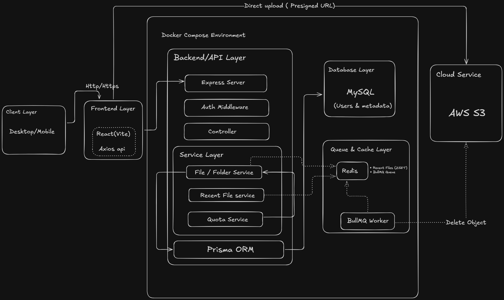
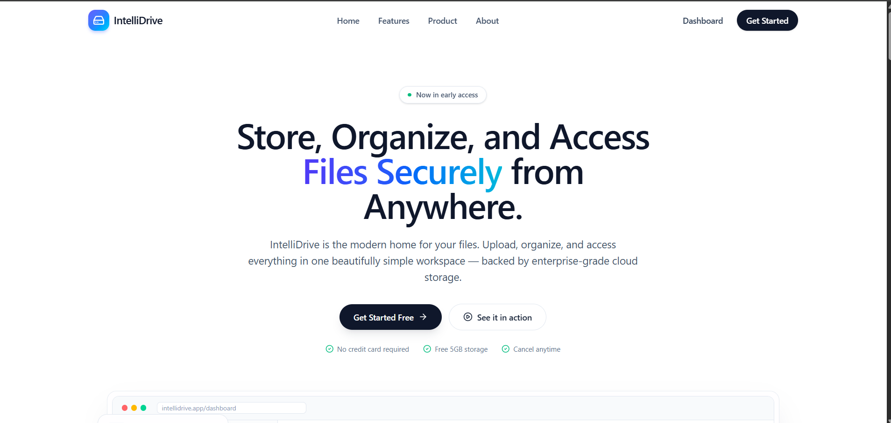
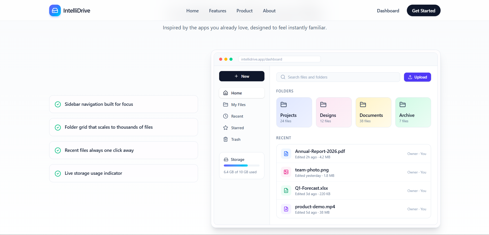
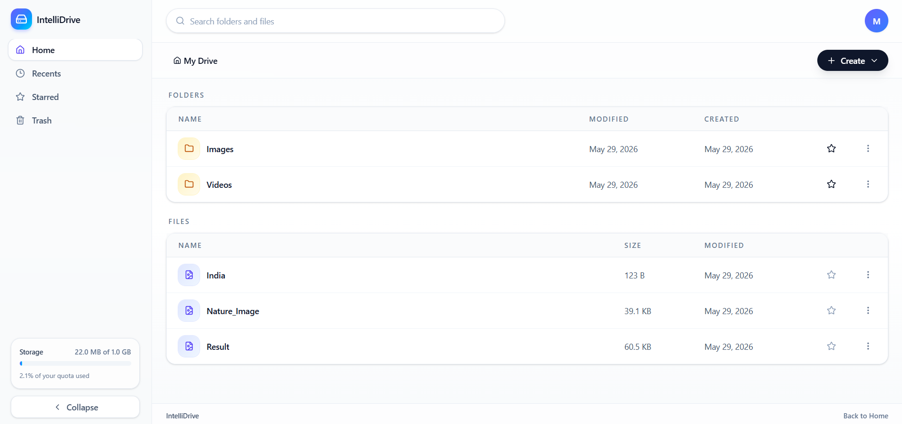
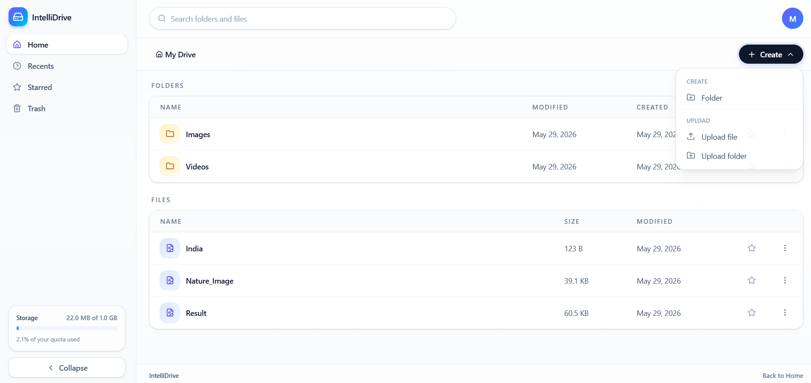
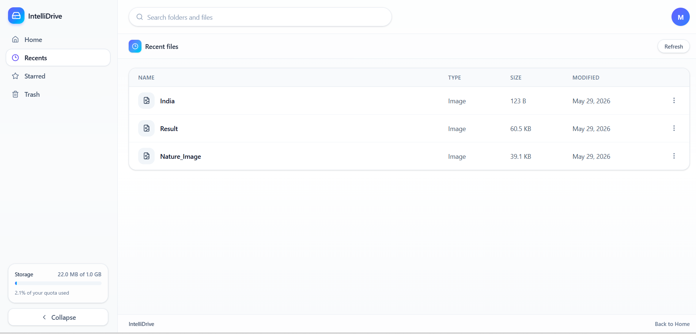
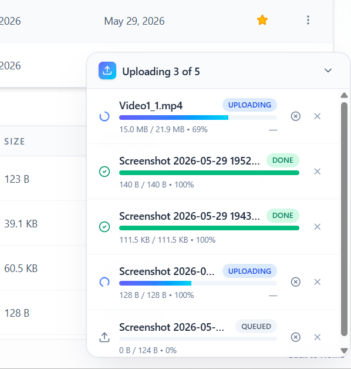

# IntelliDrive

A Google-Drive–style cloud storage application. Users can sign up, upload files (including large multi-part uploads streamed **directly to S3** via presigned URLs), organize them into nested folders, star favorites, soft-delete to Trash with a 30-day retention window, and view recently accessed files.
---

## High-Level Architecture



**Flow summary**
- Client (Desktop/Mobile browser) → React (Vite) SPA → Axios (`withCredentials: true`)
- HTTPS → Express server → Auth Middleware (JWT cookie) → Controller → Service layer
- Service layer ↔ Prisma ORM ↔ MySQL (users, nodes, stars metadata)
- Service layer ↔ Redis (recent files ZSET + BullMQ broker)
- BullMQ Worker consumes delayed `trash-cleanup` jobs and purges files from S3
- File uploads/downloads bypass the API and go **directly between the browser and AWS S3** using short-lived presigned URLs

---

## Demo Screenshots

### Landing Page


### Product Overview


### Main Dashboard


### Create Menu


### Recent Files


### Upload Drawer


---

## Tech Stack

| Layer        | Technology |
|--------------|------------|
| Frontend     | React.js, TypeScript, TailwindCSS |
| Backend      | Node.js , Express , TypeScript, Winston |
| ORM / DB     | Prisma ORM, MySQL |
| Cache / Queue| Redis , BullMQ |
| Storage      | AWS S3 |
| Auth         | JWT (HTTP-only cookie), bcrypt |
| DevOps       | Docker, Docker Compose |

---

## Features

### Authentication & Security
- **Email/password auth** — passwords hashed with bcrypt; sessions issued as JWTs stored in HTTP-only cookies.
- **Protected API** — all file and folder routes guarded by auth middleware.

### Storage & Uploads
- **Direct-to-S3 uploads** — files stream straight from the browser to S3 via short-lived presigned URLs, bypassing the API server.
- **Adaptive upload strategy** — single `PUT` for small files, automatic multipart upload (with abort support) for large ones.
- **Per-user storage quota** — default 1 GB limit, atomically enforced inside a Prisma transaction so usage can never overflow.
- **Inline preview & download** — presigned `GetObject` URLs serve files directly with the correct `Content-Disposition`.

### Organization
- **Nested folders** — a unified, self-referential `node` model represents both files and folders, enabling arbitrary hierarchy.
- **Rename, move, star/unstar** — full management of files and folders, including favorites for quick access.
- **Recent files** — the 5 most recently accessed files tracked in a Redis sorted set (`recent:files:{userId}`).

### Trash & Recovery
- **Soft delete** — deleted items move to Trash instead of being removed immediately.
- **30-day auto-purge** — a delayed BullMQ job permanently removes trashed items (and their S3 objects) after 30 days.
- **One-click restore** — restoring from Trash cancels the scheduled purge using a deterministic job ID.

### Observability
- **Structured logging** — request and service logs written via Winston to `backend/logs/`.

---

## Getting Started

### Prerequisites
- Node.js 20+
- Docker & Docker Compose
- An AWS account with an S3 bucket + IAM keys

### 1. Clone
```bash
git clone <repo-url>
cd IntelliDrive
```

### 2. Backend environment

Create `backend/.env` (local dev) and/or `backend/.env.docker` (compose):

```env
PORT=5000
FRONTEND_URL=http://localhost:5173

DATABASE_URL="mysql://root:<password>@localhost:3307/intellidrive"
DATABASE_NAME=intellidrive
DATABASE_PASSWORD=<password>

REDIS_HOST=localhost
REDIS_PORT=6379

JWT_SECRET=<long-random-string>

AWS_REGION=<region>
AWS_ACCESS_KEY_ID=<key>
AWS_SECRET_ACCESS_KEY=<secret>
AWS_BUCKET_NAME=<bucket>
```

Apply the S3 CORS policy in `backend/s3-cors.json` to your bucket (required so browsers can `PUT` directly).

### 3. Run with Docker Compose
```bash
cd backend
docker compose up --build
```
This starts `mysql` (port `3307`), `redis` (port `6379`), and `backend` (port `5000`).

### 4. Run Prisma migrations
```bash
cd backend
npx prisma migrate deploy
npx prisma generate
```

### 5. Frontend
```bash
cd frontend
npm install
npm run dev
```
App will be available at <http://localhost:5173>, talking to the API at <http://localhost:5000/api>.

Set `VITE_API_URL` in `frontend/.env` if your API runs elsewhere.

---

## Scripts

**Backend** (`backend/package.json`)
- `npm run dev` — start API with `tsx watch`

**Frontend** (`frontend/package.json`)
- `npm run dev` — Vite dev server
- `npm run build` — typecheck + production build
- `npm run preview` — preview the production build
- `npm run lint` — ESLint
